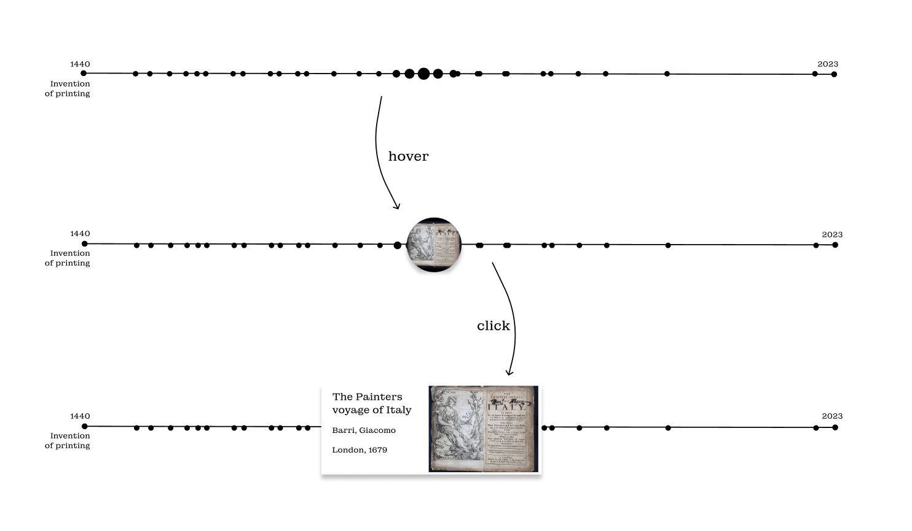
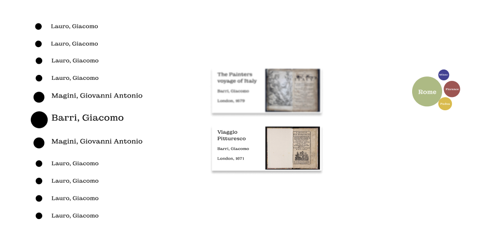
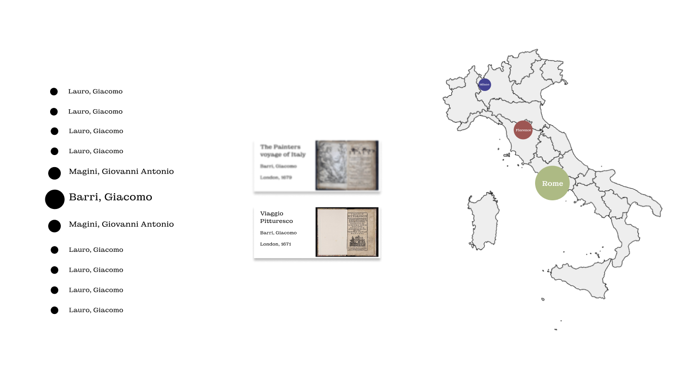

# Milestone 2

## Dataset overview

To give a general overview over all the travel books in the dataset, we want to create an interactive timeline, such that users can get a feeling for the age of the books. Many of the travelbooks contain illustrations, which can be used as thumbnail. Hovering over the datapoints representing the travelbooks will show the thumbnails and clicking on the them will reveal more information. This is in line with the lecture on interaction (overview first, then zoom and details on demand). 

The timeline can be created using the d3 libary, specifically the time scaled axis and circles. This timeline is the minimal viable product, but it can be potentially extended in several ways. One possibility is to display the books according to language or publication place and such giving the user the possibility to filter.

## Places

For each travelguide in english we can extract the top mentioned placenames and want to showcase this using a bubblegraph. Users will be able to select an author and one of their works dynamically, to display which are the highest mentioned places for this work.

For this visualisation we can use the d3 bubblegraphs inputting the counts of mentions for each book. Again the lecture on interaction is important for this visualisation, as it allows the user to brush the data. 

The visualisation allows for a lot of extensions, for example mapping the cities to their geolocation on an Italy map, as shown in the figure below. This will require geojson data for each of the cities, and would mean that we would pre-filter the data so show only cities in Italy.

