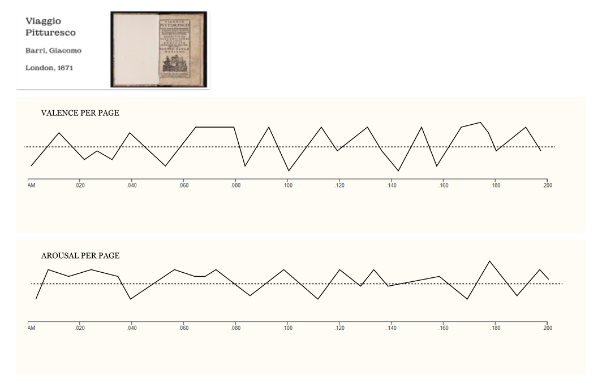
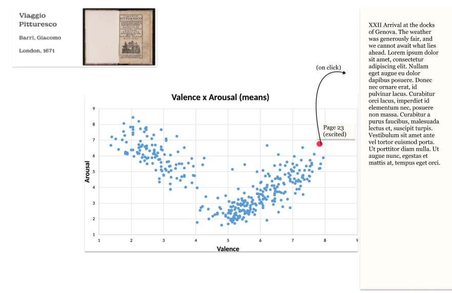
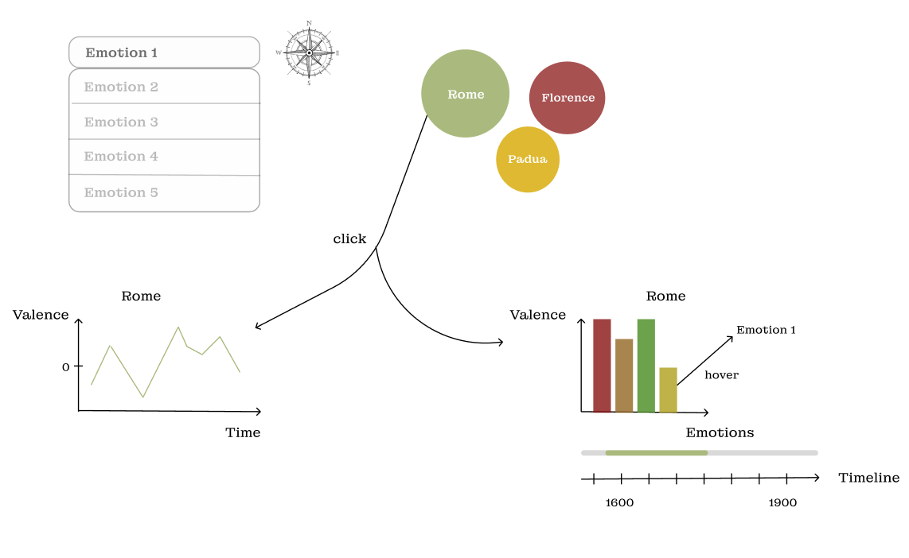

# Milestone 2

## Dataset overview

To give a general overview over all the travel books in the dataset, we want to create an interactive timeline, such that users can get a feeling for the age of the books. Many of the travelbooks contain illustrations, which can be used as thumbnail. Hovering over the datapoints representing the travelbooks will show the thumbnails and clicking on the them will reveal more information. This is in line with the lecture on interaction (overview first, then zoom and details on demand). 

The timeline can be created using the d3 libary, specifically the time scaled axis and circles. This timeline is the minimal viable product, but it can be potentially extended in several ways. One possibility is to display the books according to language or publication place and such, giving the user the possibility to filter.

## Places

For each travelguide in english we can extract the top mentioned placenames and want to showcase this using a bubblegraph. Users will be able to select an author and one of their works dynamically, to display which are the highest mentioned places for this work.

For this visualisation we can use the d3 bubblegraphs inputting the counts of mentions for each book. Again the lecture on interaction is important for this visualisation, as it allows the user to brush the data. 

The visualisation allows for a lot of extensions, for example mapping the cities to their geolocation on an Italy map, as shown in the figure below. This will require geojson data for each of the cities, and would mean that we would pre-filter the data so show only cities in Italy. It would be implemented with the leaflet.js library, introduced in the lecture on maps.

## Emotions

We would like to analyze the emotions expressed by the authors in their books. For each book (or at least the ones written in English where the extraction should be easier), we want to represent the emotions perceived in terms of *valence* and *arousal*. We can first describe the development of the two over the course of the book, by aggregating both valence and arousal per page and displaying it in a line chart. Conversely, we can use a scatter plot to place the pages. This allows to categorize each page. When hovering over a dot in the scatter plot, the page number will be displayed as well as the perceived emotion. It will also be linked to the line charts to display where in the book we currently are. Upon clicking, the entire page can be displayed and read.

Both the scatter plot and the line charts can be created using the d3 library, the images provided below are mere sketches of how the result should look like.

## Emotions and places

A further extension of displaying the emotions would be to link them to the locations visited and display the result as a bubble map. In order to do this, we will compute overall valence and emotion weighted score per book for each city. We define the overall valence score per book $VS_{book}$ of a city as the following :

$$ VS_{book} =\frac{1}{T\cdot P} \sum_{p \in pages} w(p)\cdot V(p) $$

where $T$ is the total number of times the city name appears in the book, $P$ is the total number of pages in the book, $w(p)$ is the count for page $p$ and $V(p)$ is the valence score of page $p$. Indeed, we want to attribute more weight to the valence score of the pages where the city appears mutiple times, as there is an increased chance that the two will be related. Then we combine all books to have an overall valence score for the city $VS$ :

$$VS=\frac{1}{B}\sum_{b \in books}VS_{b}$$

where $B$ is the total number of books. To get the overall emotion score we do the same except that we replace the 1D valence score by a 2D emotion vector $E=(VS, AS)$ where $AS$ is the overall arousal score, computed in a similar manner. We thus classify the city by their overall emotion score as shown in the figure below, with the radius of the bubbles depending on the arousal score. Upon clicking on one city, two plots will appear. The first one will be showing how the valence score of the city evolved over time (using the dates of parution of the guidebooks as a timeline) and the other one will be a histogram with the percentage of the different emotions for the city (or the main ones if there are too many), calculated from the emotion score of all books. There would be a timeline with a time window to choose from which periods we want to know the emotions associated to the city.

