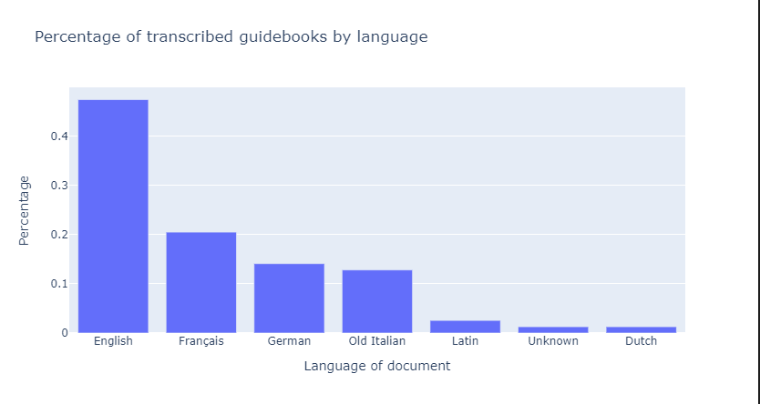

# Milestone 1

By the Group _In Viz Veritas_:
Hannah Casey (300981), Zoé Jeandupeux, Erik A. Wengle (297099)

## Dataset - Travel Guides from 1550 to 1930

The dataset we are working on is a collection of old travel guides for Italy from the rare books collection of the [Bibliotheca Hertziana](https://www.biblhertz.it/it/home) in Rome . 
The collection contains around 800 documents in several languages from the years 1550 up until 1930. 
They are sparsely illustrated and contain a lot of recognizable place names. 
All of them have been recently digitized, but only around 80 have also been transcribed using [Transkribus](https://readcoop.eu/transkribus/?sc=Transkribus). Tranksribus is an AI supported platform for text recognition and transcriptions. 

We scraped the transcripts from Transkribus and obtained the metadata directly from the Bibliotheca Hertziana, which kindly provides us access to data that can be of interest for vizualisation. We have access to metadata like title and author, year and place of publication, language of the text, and several other columns that might be of lesser interest, such as format of the document. Since the texts are in several languages, one of the potential challenges is how to use NLP techniques on the text to extract for example place names and sentiment. 

While the quality of the book transcriptions is sufficiently high, our dataset will require a large amount of preprocessing in order to extract data of interest.
The fact that these books were written in different languages, some of them being extinct such as old italian or old german, further complexifies the task. 

Nonetheless, we do want to stick to this problematic as it is a topic of great interest to us. As a group of experienced data scientists we will gladly tackle the extra challenge of the possibly cumbersome preprocessing.

## Problematic

The main axis we would like to develop is the overall travel routes taken through Italy over time, as well as the writer's perception of the visited locations in terms of valence and arousal. We would like to detect and emphasize common denominators which stay constant over time (and languages), and which factors may have changed, ideally even illustrating why these changes may have occured.

Our main vision consists of creating a website targeted to travelers wanting to visit Italy or enthusiasts who are interested about travel routes in Italy. The main component of our page should consist of a landing page, allowing visitors to specify locations in Italy they want to visit as well as languages they speak. In return, our page will provide them with travel guides of our dataset that may be of interest to them.

While this component is more on the playful side, we intend to also show deeper insights gained from the analysis of our dataset, which reflect our main development axis.

Our main motivation for this is combining the current definition of travel guides with the perception of various travellers from different locations thoughout various time periods.

## Exploratory Data Analysis

> For detailed computations and analysis regarding the EDA, see `expl_data_analysis.iypnb`

### Basic Book statistics

- There is a total of **78** distinct books.

- Page count per book:
  | Min | Max |  Mean   | Std_dev |
  | --- | --- |   ---   |   ---   |
  | 102 | 1250 | 383.86 | 193.15  |

- Word count per book:
  | Min  |   Max   |   Mean    |  Std_dev  |
  | ---  |   ---   |    ---    |    ---    |
  | 2103 | 3335171 | 466964.44 | 450411.14 |

- Languages featured:
    | Language    | Count |
    | ----------- | ----- |
    | English     | 37    |
    | French      | 16    |
    | German      | 11    |
    | Old Italian | 10    |
    | Latin       | 2     |
    | Dutch       | 1     |
    | Unknown     | 1     |

### Analysis of Book metadata

The language field provided by Transkribus seemed to be erroneous in most cases, which is why we checked the language of each transcribed book manually and corrected the corresponding fields.

Almost half of the books we have are written in English, followed by French, German and Italian. Interestingly enough, two are in latin, one in Dutch and one in a language that could not be identified.

We see that most books have been written in London, then Paris, which is in accordance with the fact that English is the most common language the guidebooks have been written in, followed by French. 

The location of the guidebooks coincide well with the language in which they were published. There seems to be no location for Dutch, but there are some books in our dataset where the place of publication is unknown.

The books have been written between 1550 and 1911. We have more books in the period between 1750 and 1870 and it is only from this period that the transcribed books are in English. There are mainly French authors around 1700-1710. The German books, though fewer than the English ones, were also written around 1800-1870. 

### Proof of concept location extraction

In order to show that the extraction of location works on the texts in the dataset, we did preliminary testing on english texts by one author. Two Named Entity Recognition modules were used, namely [locationtagger](https://pypi.org/project/locationtagger/) and [spacy entity recognizer](https://spacy.io/api/entityrecognizer). 

The spacy module can be tuned more easily to our specific case (namely cities in Italy) and performs better than the locationtagger. We counted the occurence of place names and additionally mapped the occurrence of Rome and Florence per page number. This can be potentially used as a timeline of travel. 

## Related Work

As far we know, there has been only very little work done on the collection of travel guides for Italy. One of the former directors of the library, Ludwig Schudt, worked on the [collection of early modern guide books for Rome and Italy](https://digi.ub.uni-heidelberg.de/diglit/schudt1959/) and published his work in the 1930 and 1950s. 

There has been no attempt so far to do quantitative analysis and data visualization on the guide books so far, meaning that our approach of extracting placenames and associated sentiment is novel for this dataset. Additionally, giving a visitor to the website an opportunity to explore this collection of guidebooks is new, as they are usually locked up and not publicly available. 

(HANNAH REF TO HIS WORK?, WHAT HAVE THEY DONE WITH THEIR DATA? THEY DID NOTHING WITH DATA PER SE. IT'S AN ART HISTORICAL WORK MEANING QUALITATIVE AND NOT QUANTITATIVE RESEARCH :) IF YOU WANT TO READ THE 200 PAGE BOOK PLEASE GO AHEAD) 

Other attempts to visualize datasets from the Digital Humanities referencing to literary texts include the following: 
- [The Mapping Colonial Americas Publishing Project](http://cds.library.brown.edu/mapping-genres/): Mapping of published books from the Brown library
- [Atlas of early printing](http://atlas.lib.uiowa.edu/#): Specifically the trade routes are a nice reference, in case we want to vizualise the travel routes
- [Visualizing Shakespeare plays](https://www.martingrandjean.ch/network-visualization-shakespeare/): Visualizig networks in text. Can be interesting if we want to analyze co-occurrence of placenames
Some of these visualizations are older and serve as inspiration. 

A visualization of great importance that is also related to travel is of course the [Minard map](https://bigthink.com/strange-maps/229-vital-statistics-of-a-deadly-campaign-the-minard-map/), which can to serve as historical inspiration. 
